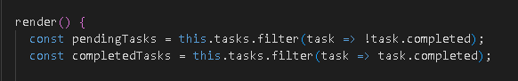
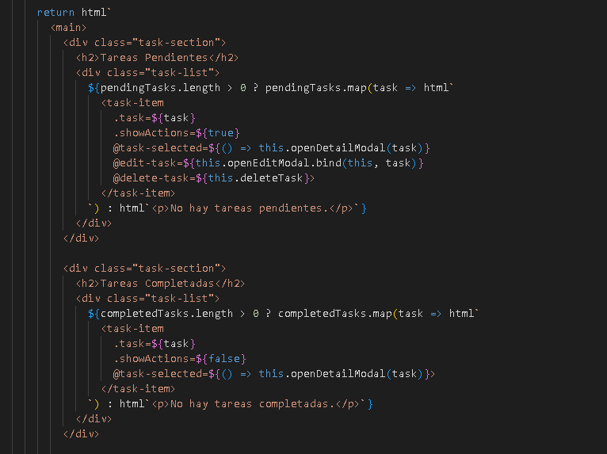
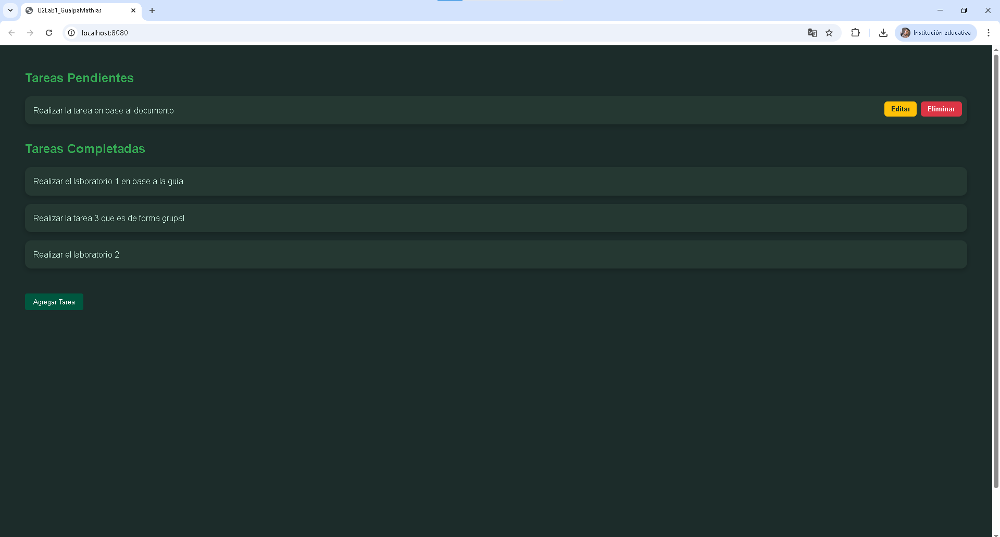
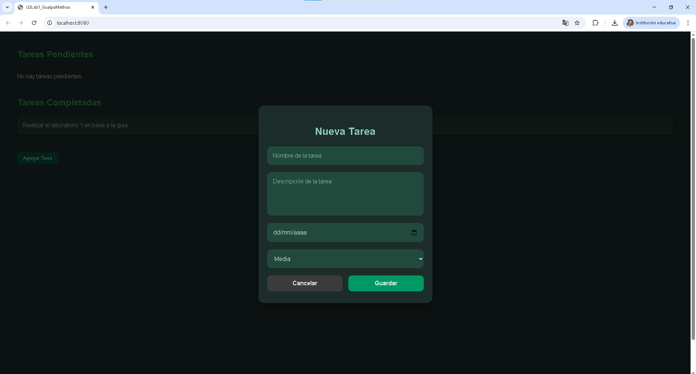
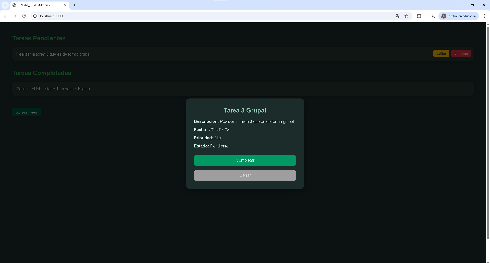
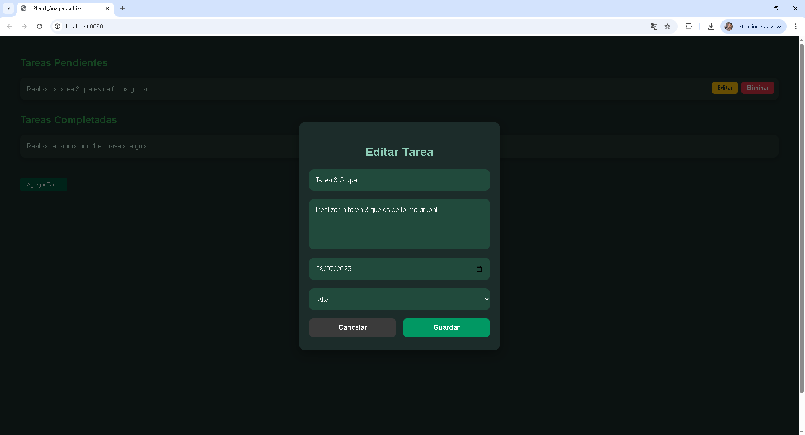
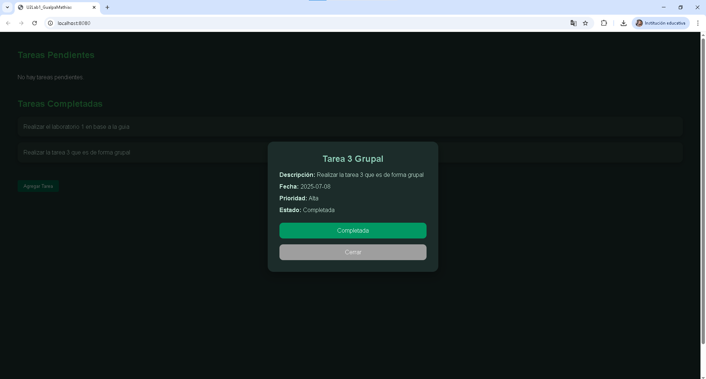

# Proyecto To-Do List con LitElement

## Descripción

Este proyecto es una aplicación para gestionar tareas (To-Do List) desarrollada con Web Components usando LitElement.  
Permite crear, editar, visualizar detalles, completar y eliminar tareas, manteniendo el estado guardado en el `localStorage`.

---

## Arquitectura del Sistema

### Componentes Principales

| Componente           | Archivo                  | Descripción                                                                                  |
|---------------------|-------------------------|----------------------------------------------------------------------------------------------|
| `<app-list>`          | `app.js`                 | Componente raíz que maneja el estado global, la lógica principal y coordina todos los subcomponentes. |
| `<task-item>`         | `task-item.js`           | Representa una tarjeta individual de tarea, mostrando su descripción y botones para editar o eliminar. |
| `<task-list>`         | `task-list.js`           | (Opcional/Extra) Agrupa tareas, permite organizar por fecha y prioridad.                      |
| `<task-modal>`        | `task-modal.js`          | Modal para crear o editar tareas, con formulario validado y controlado.                      |
| `<task-detail-modal>` | `task-detail-modal.js`   | Modal que muestra los detalles completos de una tarea, con opciones para completar o cerrar. |

---

### Estado y Comunicación

- El componente principal `<app-list>` mantiene el arreglo de tareas en su estado (`this.tasks`) y sincroniza con `localStorage`.
- Cuando un usuario crea o edita una tarea, el `<task-modal>` emite un evento personalizado `save-task` con los datos de la tarea, que el componente raíz captura para actualizar el estado.
- Las tarjetas de tareas (`<task-item>`) emiten eventos personalizados como `edit-task`, `delete-task` y `task-selected` para interacción.
- Los modales de detalle y edición se abren o cierran controlados por el estado de la aplicación.
- La comunicación entre componentes se realiza con eventos personalizados (`CustomEvent`), que se propagan (`bubbles: true, composed: true`) para que `<app-list>` pueda reaccionar y actualizar el estado global.

---

## Organización de las Tareas

El componente raíz `<app-list>` divide las tareas en dos secciones visibles en la UI:

- **Tareas Pendientes:**  
  Tareas que aún no han sido completadas. Estas muestran acciones para editar y eliminar.

- **Tareas Completadas:**  
  Tareas marcadas como completadas. Estas solo permiten ver detalles, sin acciones de edición o eliminación directa.

Esta separación se realiza en el método `render()` usando:

- **Separacion**  



Y luego se representan con el siguiente código:

- **Representacion de las secciones**  



```html
<div class="task-section">
  <h2>Tareas Pendientes</h2>
  <div class="task-list">
    ${pendingTasks.length > 0 ? pendingTasks.map(task => html`
      <task-item
        .task=${task}
        .showActions=${true}
        @task-selected=${() => this.openDetailModal(task)}
        @edit-task=${this.openEditModal.bind(this, task)}
        @delete-task=${this.deleteTask}>
      </task-item>
    `) : html`<p>No hay tareas pendientes.</p>`}
  </div>
</div>

<div class="task-section">
  <h2>Tareas Completadas</h2>
  <div class="task-list">
    ${completedTasks.length > 0 ? completedTasks.map(task => html`
      <task-item
        .task=${task}
        .showActions=${false}
        @task-selected=${() => this.openDetailModal(task)}>
      </task-item>
    `) : html`<p>No hay tareas completadas.</p>`}
  </div>
</div>
```

---

## Comunicación Detallada entre Componentes

### Eventos que disparan los componentes hijos:

- `<task-item>`  
  - `task-selected` (clic en la tarea) para mostrar detalles.  
  - `edit-task` (botón editar) para abrir el modal de edición.  
  - `delete-task` (botón eliminar) para borrar la tarea.

- `<task-modal>`  
  - `save-task` cuando el formulario se envía para crear o actualizar una tarea.  
  - `close-modal` para cancelar o cerrar el modal sin guardar.

- `<task-detail-modal>`  
  - `complete-task` para marcar la tarea como completada.  
  - `edit-task` para abrir el modal de edición desde el detalle.  
  - `delete-task` para borrar la tarea desde el detalle.  
  - `close-detail` para cerrar el modal de detalle.

### Ejemplo de envío de evento en `<task-item>`:

```js
this.dispatchEvent(new CustomEvent('edit-task', {
  detail: { task: this.task },
  bubbles: true,
  composed: true
}));
```

---

## Actualización de Estado y Persistencia

El componente `<app-list>` escucha estos eventos y actualiza su estado y persistencia:

```js
saveTask(e) {
  const task = e.detail;
  if (this.isEditing && task.id) {
    const index = this.tasks.findIndex(t => t.id === task.id);
    if (index !== -1) {
      this.tasks[index] = task;
      this.tasks = [...this.tasks];
    }
  } else {
    task.id = Date.now();
    task.completed = false;
    this.tasks = [...this.tasks, task];
  }
  this.saveTasksToStorage();
  this.closeModal();
}

saveTasksToStorage() {
  localStorage.setItem('tasks', JSON.stringify(this.tasks));
}
```

---

## Fragmentos para Referencias Visuales

### 1. Renderizado de tareas pendientes

```html
<h2>Tareas Pendientes</h2>
<div class="task-list">
  <!-- Aquí se listan los <task-item> con botones para editar y eliminar -->
</div>
```

### 2. Modal para crear o editar tarea

```html
<task-modal
  .task=${this.selectedTask}
  .isEditing=${this.isEditing}
  @save-task=${this.saveTask}
  @close-modal=${this.closeModal}>
</task-modal>
```

### 3. Modal de detalle de tarea

```html
<task-detail-modal
  .task=${this.selectedTask}
  @close-detail=${this.closeDetailModal}
  @edit-task=${this.editTaskFromDetail.bind(this)}
  @complete-task=${this.completeTask}
  @delete-task=${this.deleteTask}>
</task-detail-modal>
```

---

## Capturas de Pantalla


- **Pantalla principal con tareas pendientes y completadas**  


- **Modal para agregar o editar tarea**  


- **Detalle de tarea**  


- **Editar tarea**  


- **Completar tarea**  



