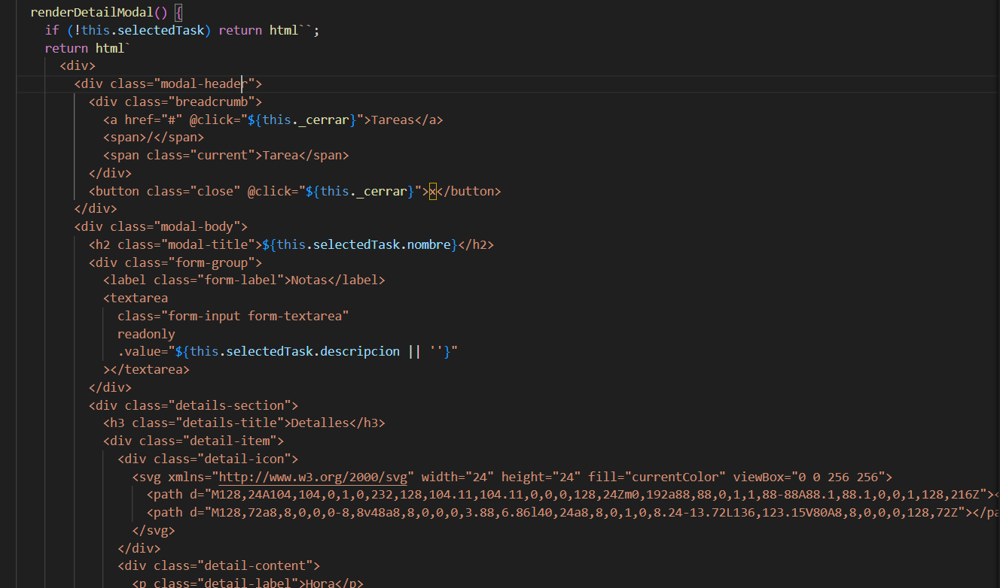
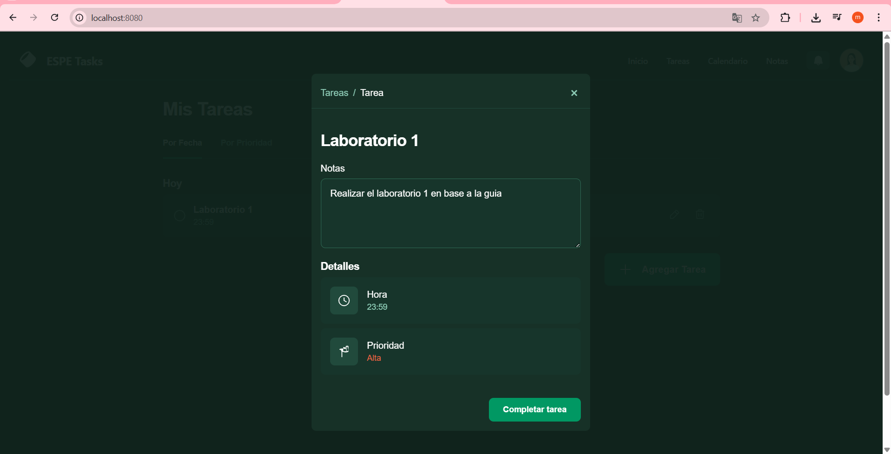
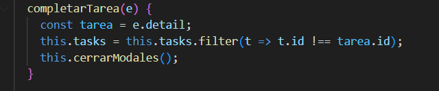
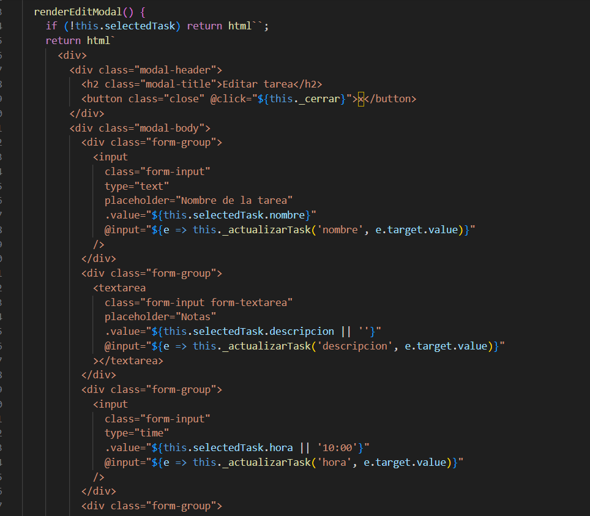
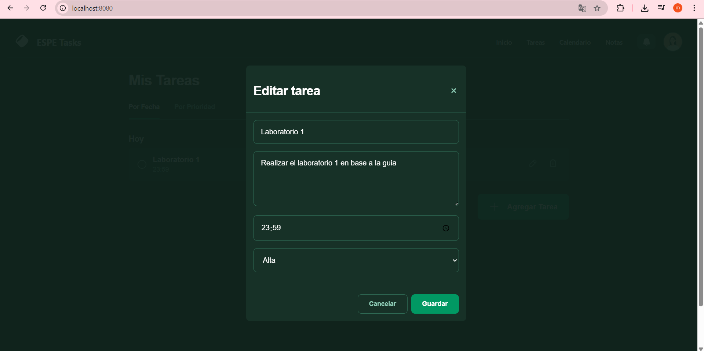
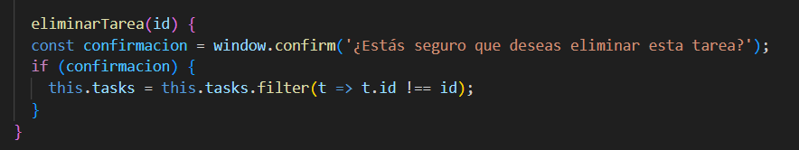
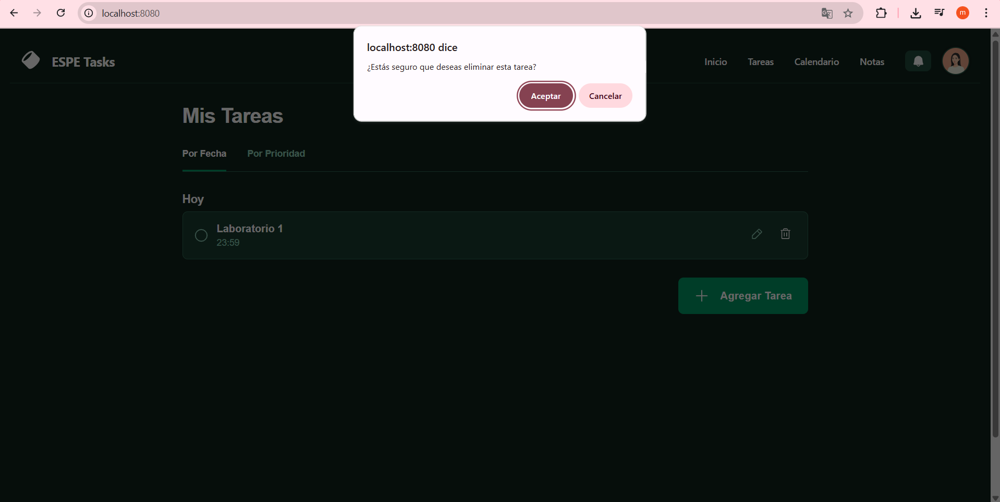

# Espe Task Manager

Una aplicación de gestión de tareas desarrollada con **LitElement** que permite a los usuarios crear, editar, visualizar, completar y eliminar tareas. Este proyecto está diseñado con una interfaz moderna, responsiva y amigable, utilizando componentes web reutilizables.

---

## Descripción del Proyecto

Este proyecto simula una aplicación de tareas donde el usuario puede:

- Agregar una nueva tarea con título, descripción, hora y prioridad.
- Editar una tarea existente.
- Visualizar los detalles de una tarea.
- Completar una tarea (lo que la elimina de la vista principal).
- Eliminar una tarea.
- Ver tareas ordenadas por hora o prioridad.

El componente principal es `<espe-task-list>`, que se comunica con el componente `<espe-task-modal>` para realizar las diferentes acciones.

---

## Componentes

### 1. `<espe-task-list>`
Componente principal que muestra la lista de tareas y contiene toda la lógica del estado de la aplicación.

### 2. `<espe-task-modal>`
Componente modal reutilizable para crear, editar o ver tareas. Se muestra u oculta según el modo actual (`add`, `edit`, `detail`).

### 3. `<navbar>`
Componente para el header en donde contiene una barra de navegacion 

---

## Características

- Interfaz moderna y responsiva.
- Animaciones suaves para modales.
- Diferenciación visual por prioridad.
- Tabs para organizar por hora o prioridad.
- Diseño claro y accesible.

---

## Comunicación entre Componentes

La comunicación entre `<espe-task-list>` y `<espe-task-modal>` se realiza mediante **eventos personalizados**.

Por ejemplo:


Y el componente padre escucha este evento:


---

## Funcionalidades y Eventos

| Funcionalidad     | Evento            | Descripción |
|------------------|-------------------|-------------|
| Agregar tarea    | `add-task`        | Enviado desde el modal cuando se crea una nueva tarea. |
| Editar tarea      | `update-task`     | Enviado mientras el usuario modifica los campos. |
| Guardar edición   | `save-edit`       | Confirma los cambios y actualiza el array de tareas. |
| Completar tarea   | `complete-task`   | Marca como completada y elimina de la vista. |
| Cerrar modal      | `close-modal`     | Cierra cualquier modal activo. |

---

## Ejemplo de función clave

### Agregar Tarea


---

## Estructura del Proyecto

```
TASK-MANAGER/
├── .vscode/
├── capturas/
├── node_modules/
├── src/
│   ├── components/
│   │   ├── espe-task-list.js        # Componente principal que muestra las tareas
│   │   ├── espe-task-modal.js       # Modal reutilizable para agregar, editar y ver tareas
│   │   └── navbar.js                # Componente de navegación
│   └── index.js                     # Inicializa el componente principal
├── index.html                       # Punto de entrada HTML
├── package.json                     # Dependencias del proyecto
├── webpack.config.js                # Configuración de Webpack
├── README.md                        # Documentación del proyecto
```

---

## Imágenes de Código

### Pantalla Principal sin cargar Tareas

Aqui una vez ejecutado el proyecto nos aparece esta pantalla principal


### Modal para Nueva Tarea

Aqui creamos el modal para agregar una nueva tarea 


Y asi se veria en la pagina web


### Lista de tareas

Aqui se va a listar las tareas que vayamos agregando


Y asi se ve la en la pagina web una vez agregada la tarea ya listada


### Vista detallada de las tareas

Aqui mediante este modal vamos a poder ver la informacion detalla de las tareas listadas



Y aqui se ve en la pagina web el modal para ver la informacion detallada de la tarea



### Completar las tareas

Aqui mediante este funcion vamos a poder completar las tareas listadas



Y cuando demos en completar si no hay mas tareas queda con en la pantalla principal ya que se limpia la tarea ya que se la completo


### Editar tareas

Aqui mediante este modal vamos a poder editar las tareas listadas



Y aqui se ve en la pagina web el modal para editar la tarea



### Eliminar tareas

Aqui mediante esta funcion vamos a poder eliminar las tareas listadas



Y aqui se ve en la pagina web nos muestra un mensaje de confirmacion para poder eliminar



---

## Autor

Mathias Gualpa - Proyecto de Práctica LitElement (Gestión de tareas)
